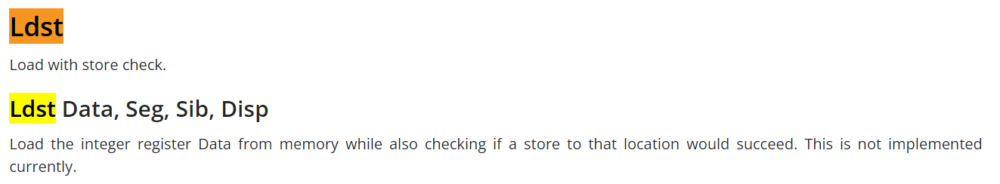
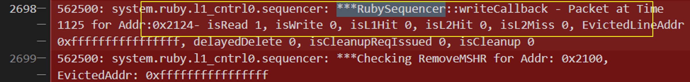
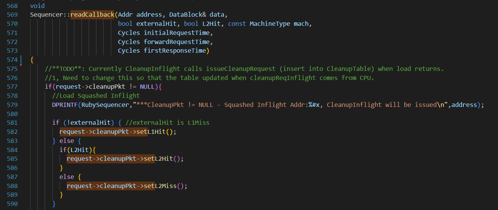
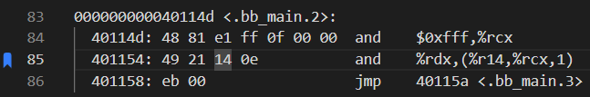
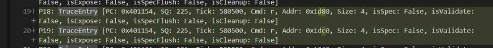
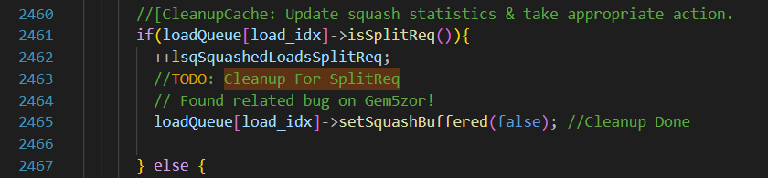
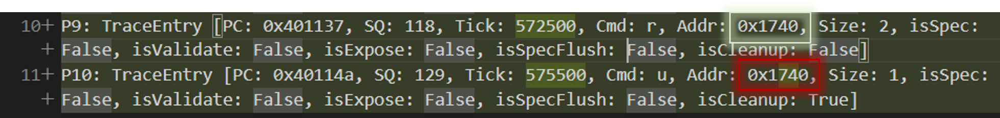

# UV3 - Speculative Store Not Cleaned Bug

**Scenario** - Execute a load-store micro-instruction

<!--    -->

- [From gem5 documentation](https://www.gem5.org/documentation/general_docs/architecture_support/x86_microop_isa/#ldst):

  

- CleanupSpec Requires Information of L1/L2 Hit/Miss on Loads to Issue Cleanups

  

- Ldst (Read as part of Read-Modify-Write) has a writeCallback() where the L2-Miss flags are not set

  

- CleanupSpec only updates status flags on readCallback()
- **BUT**: Ldst reads via a writeCallback()!

  

# UV4 - Split Requests Not Cleaned Bug

**Scenario** - An 8-byte memory request, or any memory request that crosses a cache-line boundary:

<!--    -->

- For example: 0x401154 is a Spec. Store, **split** into 2 requests to adjacent cache lines

  

- **BUT**: Cleanup not implemented for split requests!

  

Since these need to be cleaned up, but aren’t ==> Violation!

# UV5 - Too Much Cleaning Vulnerability

**Scenario** - A speculative request is made to address X. Then a **non**-speculative load request is made to the same address X.
- For our example, let X be 0x174c, with block address 0x1740
(Ignore the is* flags, they are legacy code unimplemented in our CleanupSpec testing)

  

Issue: The second, valid memory request will be cleaned up alongside the first request.
- CleanupSpec does not account for the valid memory request to 0x1740
- But the second request is non-speculative! ==> Violation!

