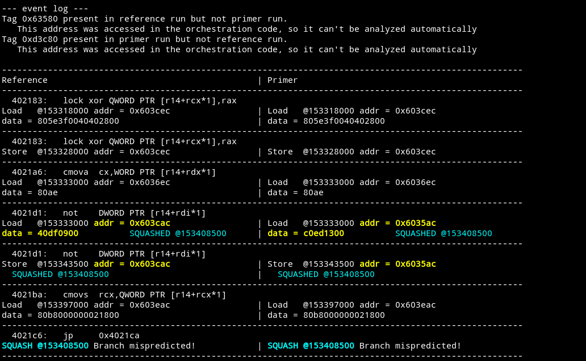
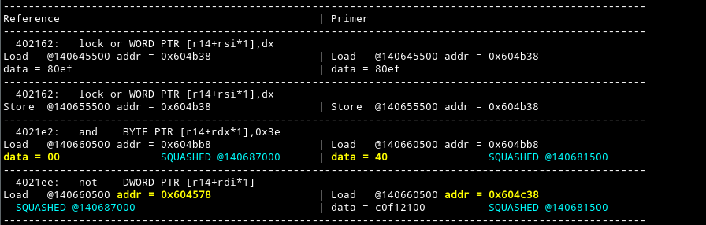
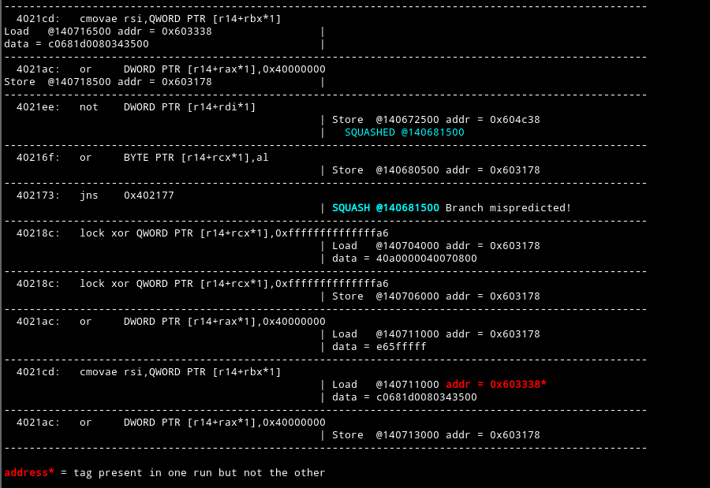

# UV1 - Speculative L1 D-Cache Evictions

Using AMuLeT we discovered a vulnerability in InvisiSpec where speculative accesses can perform cache evictions.
We ran AMuLeT on the Futuristic mode of InvisiSpec and minimized the resulting violation to obtain the program
`spec_eviction_minimized.asm`. Running our analysis tool on the violation produces the following output:



Here we see that the address `0x63580` appears in the final cache trace of the “reference” input but not the “primer” input,
and `0xd3c80` appears for the primer input but not the reference input.
These addresses were not accessed by the program, but instead were present in the cache before the program executed.
We can see that this difference in final cache traces is attributable to the differing addresses of the speculative load
of `not DWORD PTR [r14+rdi*1]`. Specifically note that the reference input accessed the cache line starting at virtual
address `0x603c80`, which happens to map to the same cache set as `0xd3c80` (note that the bottom bits are identical);
likewise the primer input accessed the cache line starting at `0x603580`, which maps to the same cache set as `0x63580`.

By looking at the gem5 debug log, we were able to confirm that speculative load requests do still cause evictions. The fix
for this is quite simple; in `src/mem/protocol/MESI_Two_Level-L1cache.sm` we replace

```
if (L1Dcache.cacheAvail(in_msg.LineAddress)) {
```

with

```
if (L1Dcache.cacheAvail(in_msg.LineAddress) || in_msg.Type == RubyRequestType:SPEC_LD) {
```

(A similar change is needed for the L2 cache.)

After this change, the violation can no longer be reproduced.

# UV2 - Same-Core Speculative Interference Attack

We also discovered a variant of the Speculative Interference attack described by Behnia et al. (2021) that works without
the presence of Simultaneous Multithreading.

After patching UV1, we re-ran AMuLeT and minimized the resulting violation to obtain the program `spec_interference_minimized.asm`.
In the output of the analysis we see some interesting behaviour:



(irrelevant lines clipped for brevity)



Here we see that although the address `0x603338` is accessed in both inputs by the instruction `cmovae rsi,QWORD PTR [r14+rbx*1]`,
the address is highlighted in red on the primer side, indicating that it only appeared in the final cache trace for that input.
Our analysis script is not powerful enough to analyse this violation further, so we can instead look at gem5's debug log, with the
ProtocolTrace debug flag.
